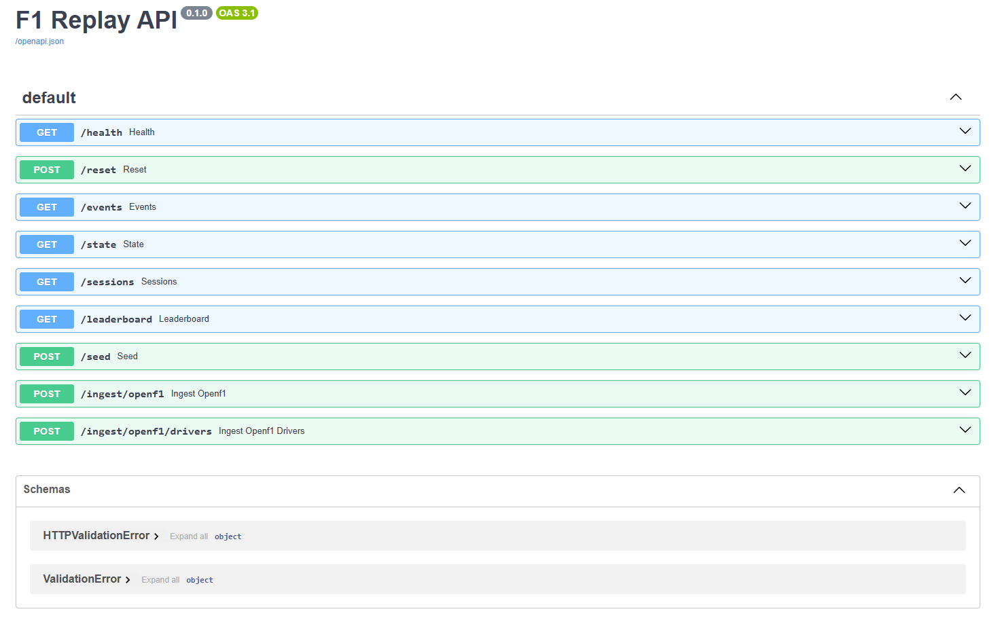
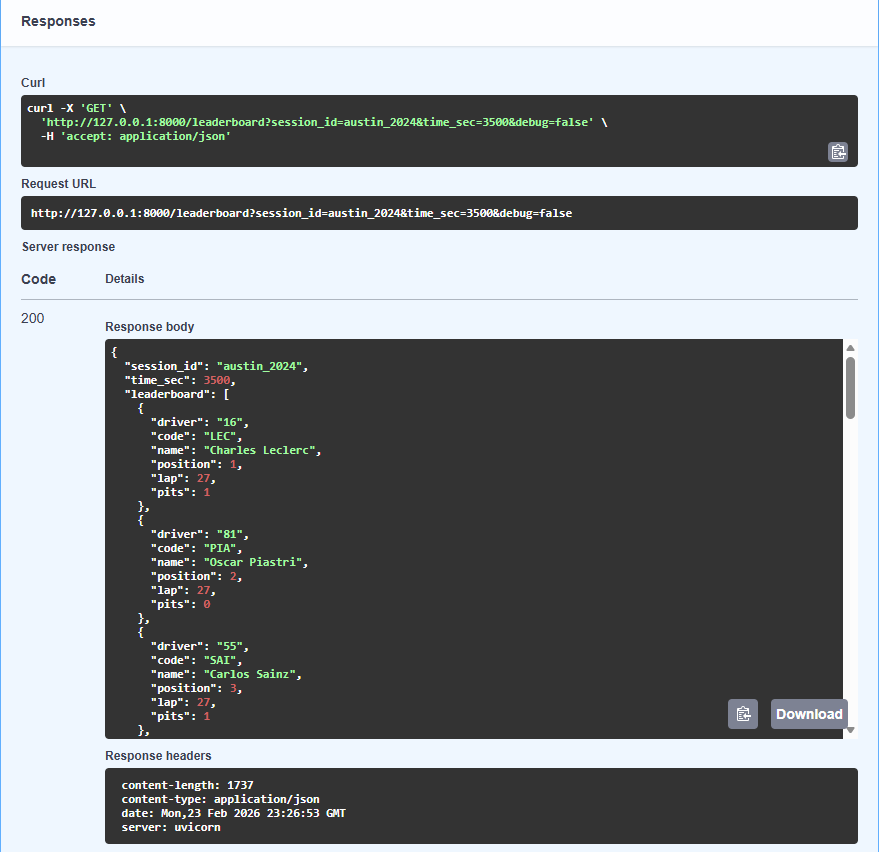
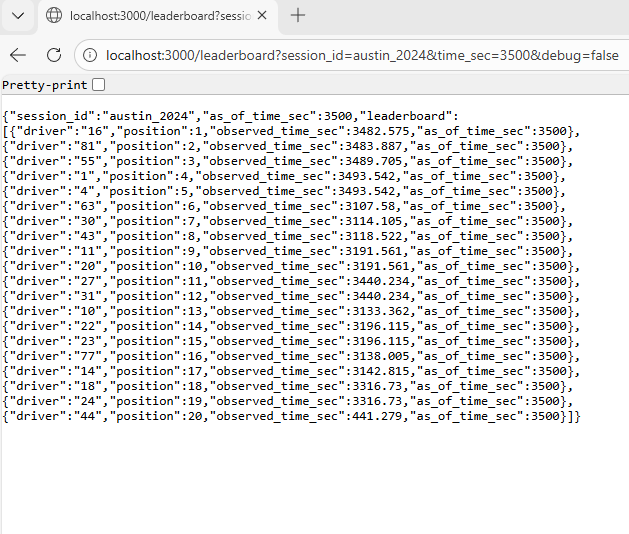

# F1 Replay API

This is a backend project that ingests real Formula 1 race data from the OpenF1 API and allows querying the race state at a specific point in time.

The goal of this project is to practice building REST APIs, working with external APIs, storing event data in a database, and reconstructing state from stored events.

The project was developed incrementally using Git for version control and GitHub Actions for continuous integration.

---

## Overview

Instead of storing the full race state directly, this system stores individual race events such as:

- LAP
- POSITION
- PIT

When a client requests a specific timestamp, the application rebuilds the race state using all events up to that time.

---

## Project Structure

Client -> FastAPI (app.py) -> Services -> Repository -> Replay Logic

- `app.py` – Defines API routes and coordinates logic
- `services/` – Handles OpenF1 API requests
- `repo/` – Contains database queries (SQLite)
- `replay/` – Contains logic for rebuilding race state

This separation keeps API routing, database access, and replay logic organized and easier to maintain.

---

## Features

- Ingest real race data from OpenF1
- Store lap, position, and pit events in SQLite
- Rebuild race state at any timestamp
- Generate a dynamic leaderboard
- Ingest driver metadata for names/codes
- Safely handle missing position updates
- Basic validation and error handling

---

## Screenshot

### FastAPI Docs (Swagger)

### Python API Leaderboard Example

### Node.js Companion API Example

## Running the Application

Start the server:

    python -m uvicorn app:app --reload

Open API Docs:

    http://127.0.0.1:8000/docs

---

## Example Workflow

1. Reset a session:

    POST /reset?session_id=abu_dhabi_2025

2. Ingest race data:

    POST /ingest/openf1?session_id=abu_dhabi_2025&openf1_session_key=9839

3. Ingest driver metadata:

    POST /ingest/openf1/drivers?session_id=abu_dhabi_2025&openf1_session_key=9839

4. Query race state:

    GET /state?session_id=abu_dhabi_2025&time_sec=1200

5. View leaderboard:

    GET /leaderboard?session_id=abu_dhabi_2025&time_sec=1200

---

## API Endpoints

### Core Endpoints

These routes are the main project workflow (ingestion + replay/query):

- `GET /health` - Basic API health check
- `GET /sessions` - List available sessions stored in the database
- `POST /ingest/openf1` - Ingest race events from the OpenF1 API
- `POST /ingest/openf1/drivers` - Ingest driver metadata (names/codes) from OpenF1
- `GET /state` - Rebuild race state at a given timestamp
- `GET /leaderboard` - Return leaderboard data at a given timestamp

### Utility / Debug Endpoints

These routes are for local testing and debugging during development:

- `POST /reset` - Clear stored data for a session before re-ingesting
- `GET /events` - Inspect stored events for a session
- `POST /seed` - Insert small demo/test data for quick local testing

---

## Tech Stack

- Python
- FastAPI
- SQLite
- Node.js (Express)
- NPM
- GitHub Actions (CI)
- OpenF1 API

---

## Node.js Companion API

This project also includes a small Express-based API located in the node-api/ folder.

The Node service:

- Connects to the same SQLite database
- Exposes REST endpoints (/health, /sessions, /leaderboard)
- Uses NPM for dependency management
- Demonstrates writing SQL queries in a Node environment

### Run the Node API (Optional)

From the project root:

    cd node-api
    npm install
    npm start

Then open:

- http://localhost:3000/health
- http://localhost:3000/sessions

---

## Continuous Integration

This repository includes a GitHub Actions workflow that runs on push and pull requests:

- Install Node dependencies
- Run basic validation checks
- Verify the Python application imports correctly

---

## What I Practiced
- Designing REST endpoints
- Writing SQL queries with joins and filtering
- Rebuilding state from event data
- Separating logic into clear modules
- Handling incomplete data safely
- Working with both Python and Node.js in backend development

---

## Future Improvements

- Add automated tests
- Add Docker support
- Deploy to AWS
- Expand CI into a full deployment workflow

