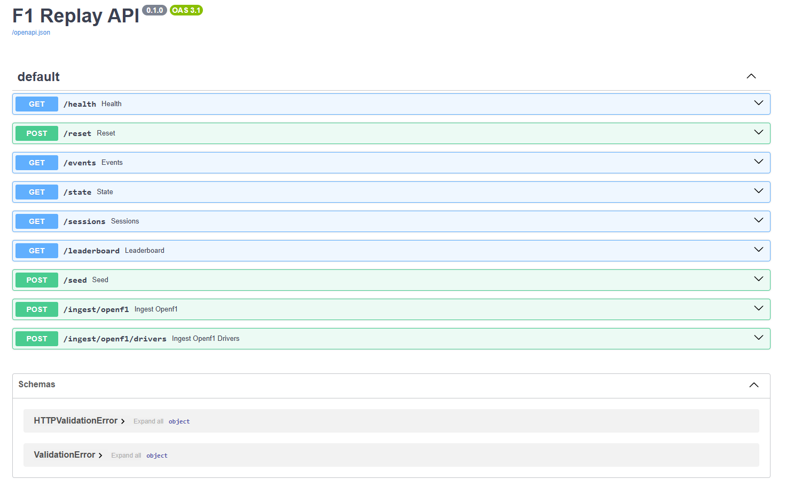
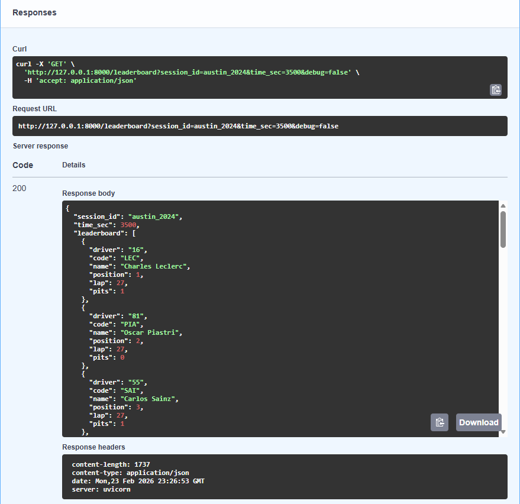
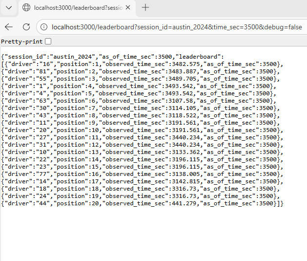

# F1 Replay API

Backend project that ingests real Formula 1 race data from the OpenF1 API and reconstructs race state at a specific point in time. Including a web frontend for picking a session and replaying it to make it more user friendly, no manual API calls or Swagger required.

This project focuses on backend engineering concepts such as external API ingestion, event-based data storage, SQL-backed querying, and reconstructing state from historical events.

The project was developed incrementally using Git for version control and GitHub Actions for continuous integration.

---

## Overview

Instead of storing the full race state directly, this system stores individual race events such as:

- LAP
- POSITION
- PIT

When a client requests a specific timestamp, the application rebuilds the race state using all events up to that time.

This approach highlights API design, database-backed event storage, and replaying historical data to reconstruct application state.

---

## Project Structure

Browser (frontend) -> FastAPI (app.py) -> Services -> Repository -> Replay Logic

- `frontend/` – Browser UI for picking a session and replaying it (plain HTML/CSS/JS)
- `app.py` – Defines API routes and coordinates logic
- `services/` – Handles OpenF1 API requests
- `repo/` – Contains database queries (SQLite)
- `replay/` – Contains logic for rebuilding race state

This separation keeps API routing, database access, and replay logic organized and easier to maintain.

---

## Features

- Ingest real race data from OpenF1
- Store lap, position, and pit events in SQLite
- Rebuild race state at any timestamp
- Generate a dynamic leaderboard for a given timestamp
- Ingest driver metadata for names/codes
- Safely handle missing position updates
- Basic validation and error handling
- Web frontend for picking a session by year / Grand Prix / session type, with a scrubbable leaderboard

---

## Web Frontend

A browser UI is included so sessions can be picked without knowing an OpenF1 `session_key` in advance.

1. Open the app in a browser, the root URL redirects straight to the picker.
2. Pick a **year**, a **Grand Prix**, and a **session** (Practice 1/2/3, Qualifying, Race, etc.), all populated live from OpenF1.
3. Click **Load Session** this resets, ingests events, and ingests driver metadata for that session in one step.
4. Scrub through the session with the time slider, or click **Play** to watch the leaderboard update automatically.

The frontend lives in `frontend/` (plain HTML/CSS/JS, no build step) and is served by FastAPI itself at `/ui`.

---

## Screenshots

### FastAPI Docs (Swagger)

### Python API Leaderboard Example

### Node.js Companion API Leaderboard Example

## Running the Application

Start the server:

    python -m uvicorn app:app --reload

Open the app:

    http://127.0.0.1:8000/

This redirects to the web frontend at `/ui/`. API docs (Swagger) are still available at:

    http://127.0.0.1:8000/docs

---

## Example Workflow

The frontend (above) handles this automatically. This is what it's doing under the hood, and how to drive the same flow manually via the API:

1. One-click load (reset + ingest events + ingest drivers) for a session:

    POST /load?session_id=abu_dhabi_2025&openf1_session_key=9839

   Same as running these three calls yourself:

    POST /reset?session_id=abu_dhabi_2025
    POST /ingest/openf1?session_id=abu_dhabi_2025&openf1_session_key=9839
    POST /ingest/openf1/drivers?session_id=abu_dhabi_2025&openf1_session_key=9839

2. Query race state:

    GET /state?session_id=abu_dhabi_2025&time_sec=1200

3. View leaderboard:

    GET /leaderboard?session_id=abu_dhabi_2025&time_sec=1200

If you don't already know the `openf1_session_key`:

    GET /openf1/meetings?year=2025
    GET /openf1/sessions?meeting_key=<meeting_key from above>

---

## API Endpoints

### Core Endpoints

These routes are the main project workflow (ingestion + replay/query):

- `GET /health` - Basic API health check
- `GET /sessions` - List available sessions stored in the database
- `GET /openf1/meetings` - List Grand Prix weekends for a season (`?year=2025`)
- `GET /openf1/sessions` - List sessions (practice/qualifying/race/etc) for a Grand Prix weekend (`?meeting_key=...`)
- `POST /load` - One-click reset + ingest events + ingest drivers for a session; used by the frontend's "Load Session" button
- `POST /ingest/openf1` - Ingest race events from the OpenF1 API
- `POST /ingest/openf1/drivers` - Ingest driver metadata (names/codes) from OpenF1
- `GET /state` - Rebuild race state at a given timestamp
- `GET /leaderboard` - Return leaderboard data at a given timestamp

### Utility / Debug Endpoints

These routes are for local testing and debugging during development:

- `POST /reset` - Clear stored data for a session before re-ingesting
- `GET /events` - Inspect stored events for a session
- `POST /seed` - Insert small demo/test data for quick local testing

---

## Tech Stack

- Python
- FastAPI
- SQLite
- Vanilla HTML/CSS/JS (frontend, no build step)
- Node.js (Express)
- NPM
- GitHub Actions (CI)
- OpenF1 API

---

## Node.js Companion API

This project also includes a small Express-based API located in the `node-api/` folder.

The Node service:

- Connects to the same SQLite database
- Exposes REST endpoints (/health, /sessions, /leaderboard)
- Uses NPM for dependency management
- Demonstrates writing SQL queries in a Node environment

### Run the Node API (Optional)

From the project root:

    cd node-api
    npm install
    npm start

Then open:

- http://localhost:3000/health
- http://localhost:3000/sessions

---

## Continuous Integration

This repository includes a GitHub Actions workflow that runs on push and pull requests:

- Install Node dependencies
- Run basic validation checks
- Verify the Python application imports correctly

---

## What I Practiced
- Designing REST endpoints
- Writing SQL queries with joins and filtering
- Rebuilding state from event data
- Separating logic into clear modules
- Handling incomplete data safely
- Working with both Python and Node.js in backend development
- Building a small vanilla JS frontend to drive the API without Swagger

---

## Future Improvements

- Add automated tests
- Add Docker support
- Deploy to AWS
- Expand CI into a full deployment workflow

